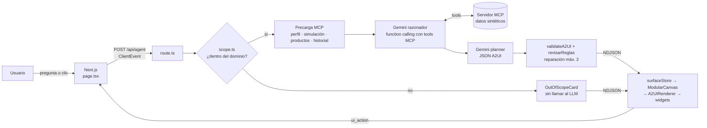

# Tu rumbo Banorte — Banorte × Tec de Monterrey

**Tu rumbo Banorte** orienta sobre **tarjetas de crédito, créditos y préstamos** dentro de la banca
digital. El usuario describe su situación y el agente **construye la pantalla**
que la explica: un tablero con el veredicto, gráficas con sus números reales y
los siguientes caminos. Cada interacción con esa pantalla regresa al agente y
puede cambiarla.

| Pieza del reto | Cómo la cubrimos |
|---|---|
| **LLM al centro** | Gemini en dos pasos: un razonador que consulta MCP y un planner que diseña la UI |
| **MCP** para datos y acciones | Servidor propio (`apps/mcp`) con 7 tools sobre datos sintéticos |
| **A2UI** para la interfaz | Mensajes A2UI v0.9.1 validados contra un catálogo propio de 18 componentes |
| **El ciclo se cierra** | Cada clic en la UI generada viaja como `ui_action` al agente y produce una pantalla nueva |

---

## Arranque

Requisitos: Docker y una API key de Gemini.

```bash
cp .env.example .env          # pon tu GEMINI_API_KEY
docker compose up --build
```

| Servicio | URL |
|---|---|
| Tu rumbo Banorte | http://localhost:3000 |
| Galería de widgets | http://localhost:3000/dev/gallery |
| Banco de pruebas del tablero | http://localhost:3000/dev/canvas |
| Servidor MCP (Streamable HTTP) | http://localhost:8787/mcp · salud en `/health` |

```bash
docker compose up -d                        # en segundo plano
docker compose logs -f web                  # logs del frontend (incluye tiempos por fase)
docker compose down                         # apagar
docker compose up -d --build -V             # tras cambiar dependencias: renueva node_modules del contenedor
```

### Variables de entorno

| Variable | Servicio | Uso |
|---|---|---|
| `GEMINI_API_KEY` | web | Obligatoria |
| `GEMINI_MODEL` | web | Primer modelo de la cadena (por omisión `gemini-2.5-flash`) |
| `MCP_SERVER_URL` | web | Por omisión `http://mcp:8787/mcp` |
| `DEMO_RANDOM_CLIENT` | mcp | `false` fija al cliente `CLI131`; si no, cada sesión sortea un cliente sintético |

### Pruebas

```bash
pnpm install && pnpm test     # validador del protocolo A2UI (Node 22.18+)
```

---

## Arquitectura



### Un turno, paso a paso

1. **Evento.** El usuario escribe o pica un widget. `page.tsx` manda un
   `ClientEvent` a `POST /api/agent` junto con las surfaces que ya están en
   pantalla.
2. **Filtro de alcance** (`lib/agent/scope.ts`). Saludos y temas ajenos se
   resuelven con expresiones regulares y regresan una `OutOfScopeCard` sin gastar
   una llamada al modelo. Ante la duda, la consulta pasa.
3. **Precarga MCP** (`lib/agent/mcp.ts`). Se abre una sesión MCP y se piden en
   paralelo los datos que el agente siempre necesita.
4. **Razonamiento** (`lib/agent/gemini.ts`). Gemini recibe la intención, los datos
   precargados y **todas las tools MCP como function declarations**. Si necesita
   algo más (p. ej. `get_eligible_cards`), la llama. Devuelve un resumen y los
   resultados de las tools.
5. **Planner** (`lib/agent/planner.ts`). Otra llamada a Gemini convierte eso en
   mensajes A2UI, limitada al catálogo. Toda cifra debe venir de una tool.
6. **Validación.** Cada mensaje pasa por `validateA2UI` (esquema + catálogo +
   props obligatorias + integridad de ids) y el plan completo por `revisarReglas`
   (jerarquía visual, máx. 3 tarjetas con marco, al menos una gráfica, sin
   párrafos, claves correctas). Los errores vuelven al modelo, máximo 2 veces.
7. **Render.** Los mensajes llegan como NDJSON; el reducer de `surfaceStore.ts`
   los aplica y `A2UIRenderer` monta cada componente desde `ComponentRegistry`.
8. **Vuelta.** Un clic en un widget emite `ui_action`; los botones que ya traen
   una pregunta redactada (`NextSteps`, sugerencias) se envían como pregunta nueva.

---

## Protocolo de interfaz (A2UI)

Implementamos **A2UI v0.9.1** con tipos, validador y renderer propios
(`packages/a2ui`, `apps/web/src/components`). No usamos un SDK externo.

**Del agente a la UI** — un mensaje JSON por línea:

| Mensaje | Qué hace |
|---|---|
| `createSurface` | Crea una surface. **Un widget del tablero = una surface** |
| `updateComponents` | Lista plana de componentes con `id`, `component`, `children` y `root` |
| `updateDataModel` | Cambia datos por JSON Pointer sin regenerar componentes; las props pueden ser `{ "path": "/..." }` |
| `deleteSurface` | Quita una surface |
| `updateCanvasLayout` | *Extensión propia.* Posición de cada surface en el grid |
| `updateGuidance` | *Extensión propia.* Pasos de spotlight (driver.js) sobre `data-a2ui-id` |

**De la UI al agente** — `ClientEvent` (formato propio): `user_message`,
`ui_action` (`surfaceId`, `componentId`, `name`, `payload`) y
`canvas_layout_changed`.

**Transporte:** un `POST /api/agent` por turno con respuesta
`application/x-ndjson` en streaming. El planner genera el plan completo y el
servidor lo envía mensaje por mensaje.

**Catálogo** (`packages/catalog/banorte-catalog.json`): es la única fuente de
verdad. El validador rechaza cualquier componente que no esté ahí o al que le
falte una prop obligatoria.

| Grupo | Componentes |
|---|---|
| Lectura principal | `HeadlineVerdict`, `RiskAlert`, `NextSteps`, `Text` |
| Gráficas | `LineChart`, `CashflowChart`, `BarChart`, `DonutChart`, `ProgressBars`, `CardRanking` |
| Productos y simulación | `ProductPortfolio`, `CardShowcase`, `DebtSimulator`, `OptionComparator` |
| Interacción | `ExplorationCard`, `UnderstandingSummary`, `ActionPlan`, `OutOfScopeCard` |

Para agregar un componente: entrada en el catálogo → widget en
`components/widgets/index.tsx` → registro en `ComponentRegistry.tsx` → ejemplo en
`/dev/gallery` → forma de sus props en el prompt del planner.

---

## Servidor MCP

`apps/mcp` — Express + `@modelcontextprotocol/sdk`, transporte Streamable HTTP
sin estado (un `McpServer` por request). Cada tool declara si es `[read]` o
`[write]`.

| Tool | Acceso | Devuelve |
|---|---|---|
| `get_financial_profile` | read | Perfil del cliente de la sesión y supuestos marcados como tales |
| `get_my_products` | read | Productos contratados, no contratados y resumen de deuda |
| `get_financial_history` | read | Enero a agosto de 2026, `financeScore` y planes de ahorro |
| `simulate_restructure` | read | Pago mensual, CAT, costo total e intereses a 12, 18 y 24 meses |
| `get_eligible_cards` | read | Tarjetas elegibles ordenadas, no elegibles con motivo y alerta de endeudamiento |
| `get_card_catalog` | read | Catálogo de tarjetas con CAT, anualidad, requisitos y fuente |
| `apply_restructure_plan` | **write** | Rechaza si `confirmadoPorUsuario` no es `true` |

Los cálculos viven en el MCP, nunca en el modelo:

| Archivo | Calcula |
|---|---|
| `finance.ts` | Amortización de la reestructura |
| `eligibility.ts` | Elegibilidad (ingreso, edad, tipo de persona), puntaje de conveniencia y riesgo de deuda |
| `salud.ts` | `financeScore` y planes de ahorro |
| `data.ts` | Carga de los CSV y supuestos del producto |

### Datos

Todo es **sintético** (`synthetic: true`), salvo el catálogo de tarjetas, que
toma CAT, anualidad y requisitos publicados.

| Archivo (`apps/mcp/seed/`) | Contenido |
|---|---|
| `clientes_sintetico_con_nombres.csv` | 150 clientes con perfil, productos, deuda y score |
| `historial_mensual_sintetico.csv` | 8 meses por cliente; agosto cuadra con el perfil |
| `catalogo_tarjetas.csv` | Productos Banorte con CAT, tasa, anualidad, requisitos y URL oficial |
| `generar_historial.py` | Regenera el historial: `python3 apps/mcp/seed/generar_historial.py` |

Lo que el seed no trae (pago mínimo al 10% del saldo, plazos y CAT de la
reestructura) se devuelve en un campo `supuestos` o `nota`, separado de los datos.

---

## Decisiones y tradeoffs

| Decisión | Por qué | Costo |
|---|---|---|
| **Gemini** (`@google/genai`) con cadena de modelos | Function calling nativo y cuota gratuita. Ante 429/404 pasa al siguiente modelo y ante 503 reintenta | La cuota gratuita es baja por modelo y día; para una demo larga conviene facturación |
| **Dos llamadas al LLM** (razonar y diseñar) | Separa "qué está pasando" de "cómo se ve"; el planner no ve tools y solo copia cifras | Una llamada más por turno |
| **Precarga de contexto MCP** | Cada turno de tool era una llamada extra en serie: el razonamiento bajó de ~19 s a ~1.6 s | El modelo casi nunca necesita pedir tools; siguen disponibles para lo que no se precarga |
| **JSON sin `responseSchema`** | El schema de Gemini no expresa la unión de mensajes ni las props abiertas | La garantía es `validateA2UI` + reparación; si se agotan los intentos se emite el mejor plan válido y, en último caso, un texto de respaldo |
| **Reglas de producto en código** (`revisarReglas`) | "Casi siempre" no basta en una demo: jerarquía visual, gráficas y alerta de riesgo se verifican | Reintentos cuando el modelo no las cumple |
| **Filtro de alcance por regex** | "hola" no debe costar un tablero ni cuota | Puede equivocarse; la tarjeta ofrece "preguntarlo de todos modos" |
| **Geometría decidida por el canvas** (`canvasLayout.ts`) | El modelo no puede adivinar la altura de un texto que no ha visto | El agente solo decide qué widgets y en qué orden |
| **Plazos del simulador en el cliente** | Los tres plazos llegan juntos: cambiar de plazo es instantáneo y sin red | Payload algo mayor |
| **Cálculos y elegibilidad en MCP** | Respuesta verificable e igual cada vez; el LLM explica, no decide | Más código de dominio |
| **NDJSON sobre POST** en vez de SSE/WebSocket | Un request por turno con el evento en el body; simple de validar mensaje por mensaje | El plan se genera completo antes de enviarse |
| **Gráficas en SVG a mano** | Sin dependencias pesadas y con control total de la marca | Más código en `widgets/index.tsx` |
| **Datos en CSV en memoria** | Arranque inmediato y seed reproducible | Sin persistencia entre reinicios |

### Limitaciones conocidas

- **Una sesión de demo a la vez.** El cliente de la sesión vive en memoria del
  MCP (`data.ts`), compartido entre pestañas.
- **Cuota de Gemini.** Cada turno usa 2 llamadas o más; los logs muestran
  `[agent] mcp · razonamiento · planner · total` y los cambios de modelo.

---

## Estructura

```
apps/
  web/                      Next.js 15 (App Router)
    src/app/page.tsx          prompt, historial y tablero
    src/app/api/agent/        endpoint del agente (stream NDJSON)
    src/app/dev/              galería de widgets y banco de pruebas del tablero
    src/components/           A2UIRenderer, ComponentRegistry, ModularCanvas, widgets
    src/lib/agent/            gemini.ts, mcp.ts, planner.ts, scope.ts
    src/lib/                  surfaceStore, binding, canvasLayout, suggestions
  mcp/                      servidor MCP
    src/                      server.ts, data.ts, finance.ts, eligibility.ts, salud.ts
    seed/                     CSV sintéticos y generador del historial
packages/
  a2ui/                     tipos, validador (Zod) y pruebas del protocolo
  catalog/                  banorte-catalog.json
```
